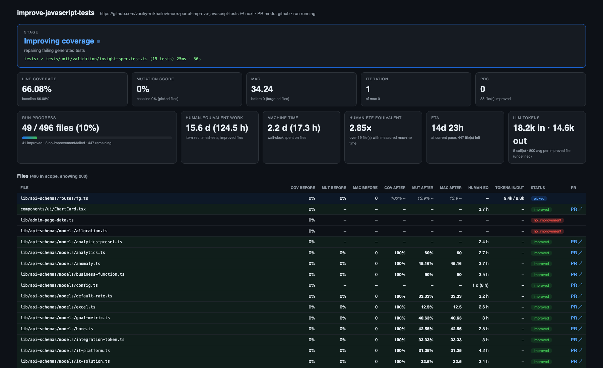
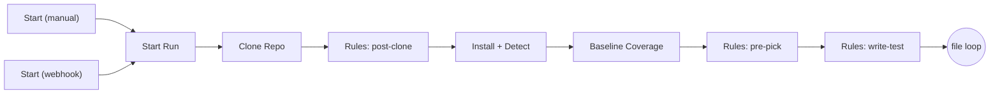
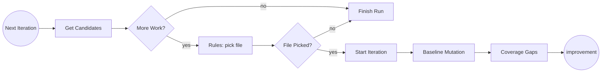
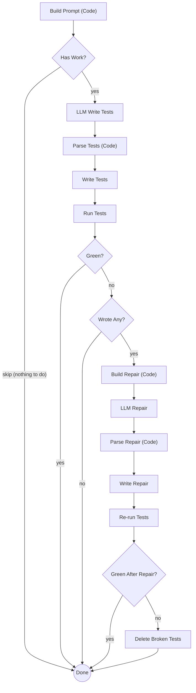
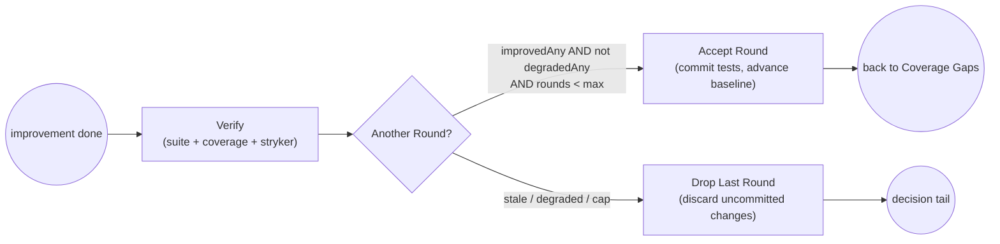
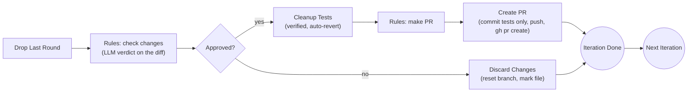
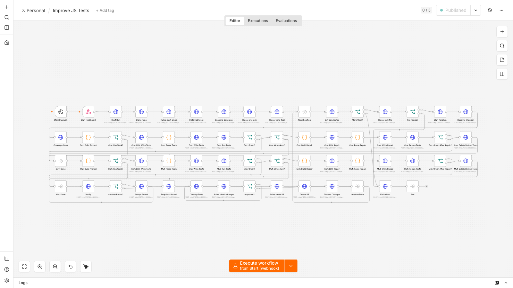

# improve-javascript-tests — a practical guide

*An adaptable n8n pipeline, in one Docker container, that points at any JavaScript/TypeScript
repository and produces pull requests that measurably improve its tests.*

The metric it optimizes is **MAC — Mutation-Adjusted Coverage**:

```
MAC = line-coverage % × mutation-score %   (mutation score from Stryker)
```

Line coverage alone overstates test quality: a line can be executed by a test that asserts
nothing. Mutation testing fixes that — Stryker plants small bugs ("mutants") and checks whether
any test fails. MAC rewards tests that both *reach* the code and *constrain* its behavior.

This guide covers: [Getting started](#1-getting-started) · [How to use it](#2-how-to-use-it) ·
[How it works](#3-how-it-works) · [How to modify it](#4-how-to-modify-it) ·
[Troubleshooting](#5-troubleshooting) · [Reference](#6-reference).

The research framing (problem → Definition of Done → reward formula) lives in `RESEARCH.md`;
the verbatim problem statement in `PROBLEM.md`; evaluation history in `eval/RESULTS.md`.

---

## 1. Getting started

**Prerequisites**: Docker with Compose; a GitHub personal-access token with `repo` scope (to
clone, push branches, open PRs); an OpenAI-compatible LLM endpoint (this deployment uses
`qwen-3.6-27b-fp8` on vLLM).

```bash
git clone <this repo> && cd improve-javascript-tests
cp .env.example .env
```

Edit `.env` — the four lines that matter first:

```bash
REPO_URL=https://github.com/your-org/your-js-repo   # the repo to improve
REPO_BRANCH=main                                    # base branch for PRs
SCOPE_GLOB=src/**/*.{js,ts,jsx,tsx}                 # which source files are in scope
GH_TOKEN=ghp_...                                    # clone + push + PR
```

Then:

```bash
docker compose up -d --build
```

That single command starts everything: the n8n orchestrator, the sidecar runner, and the
dashboard. On first boot the container creates the n8n owner account, imports and activates the
workflow, and mints a 10-year auth token — no manual n8n setup.

**Smoke test** (recommended): set `SCOPE_LIMIT=1` for your first run so the pipeline improves a
single file end-to-end before you commit to a full pass.

On this deployment the UIs are behind Caddy basic-auth:

| URL | What |
|---|---|
| `https://improve-javascript-tests.mikhailov.tech` | n8n editor (no n8n login — token injected by Caddy) |
| `https://improve-javascript-tests.mikhailov.tech/dashboard` | live dashboard |

---

## 2. How to use it

### 2.1 Start a run

Two equivalent ways:

- **n8n UI** — open the workflow *Improve JS Tests* and click *Execute workflow*. Runs with the
  `.env` defaults.
- **Webhook** — POST to `/webhook/improve-run`. Any config key can be overridden per run
  (camelCase), without touching `.env`:

```bash
curl -X POST https://improve-javascript-tests.mikhailov.tech/webhook/improve-run \
  -u admin:<basic-auth-password> -H 'Content-Type: application/json' \
  -d '{
    "repoUrl": "https://github.com/your-org/another-repo",
    "repoBranch": "main",
    "scopeGlob": "lib/**/*.ts",
    "scopeLimit": 5,
    "prMode": "github",
    "rules": { "pick_file": "only touch parsing modules" }
  }'
```

### 2.2 Watch it live

The dashboard answers "what is it doing right now": a stage banner
(**cloning → installing → measuring baseline → picking a file → improving coverage →
improving mutation score → improving MAC → preparing PR**) with the live output line of
long-running steps (npm install, vitest, Stryker), per-file before/after metrics, rule
decisions, opened PRs, and an event feed. It polls every 2 seconds. The n8n editor additionally
shows the node-by-node execution in real time.



### 2.3 What you get

One branch and **one PR per improved file** — only where improvement actually happened. Each PR
body carries a measured before/after table (coverage, mutation score, MAC). Files that could not
be improved are discarded cleanly; no PR is opened for them.

- `PR_MODE=github` — pushes the branch and opens a real PR via `gh`.
- `PR_MODE=local` — for repos you don't own: records the branch, a patch file, and the full PR
  payload under `/data/prs/` instead of pushing.

### 2.4 The improvement loop per file (multi-round)

A picked file is improved in **rounds**. Each round: write tests for uncovered code, write tests
that kill surviving Stryker mutants, re-measure everything. The round is **kept only if at least
one of coverage / mutation / MAC improved and none degraded**; otherwise the round's changes are
dropped. There is exactly one round per file. Iterating was tried and measured: a second round
gained **+0.00 MAC on five files out of five**, at up to 25 minutes each, because one take already
writes a test for every site it is going to attack. The file then gets one PR if it netted
improvement.

### 2.5 Team rules — steering every stage

Six free-text rules, set in `.env` (or per run via the webhook), are interpreted by the LLM at
their stage, with mechanical guardrails enforcing the non-negotiables:

| Variable | Stage | Example |
|---|---|---|
| `RULES_POST_CLONE` | after cloning | `read AGENTS.md to find out how to behave` |
| `RULES_PRE_PICK` | before picking | `create a separate branch per file named tests/improve-{file}` |
| `RULES_PICK_FILE` | picking a file | `don't touch ui` |
| `RULES_WRITE_TEST` | writing tests | `don't use introspection; no snapshot tests` |
| `RULES_CHECK_CHANGES` | validating | `good only if suite green and MAC improved` |
| `RULES_MAKE_PR` | making the PR | `title starts with "test:"; body has a metrics table` |

Every rule application is recorded (visible on the dashboard under *Rule decisions*), so you can
audit what the LLM decided and why. If a pick rule exists but the LLM's answer is unusable, the
pipeline **refuses to pick mechanically** rather than risk violating the rule.

Guardrails that hold regardless of rules: the pipeline only ever writes *test* files (paths must
match test conventions), the suite must stay green, MAC must strictly improve for a PR, and a
cleanup pass (see §3.4) is verified by re-measurement.

### 2.6 Full-repo runs

For a whole repository, don't run one giant execution. Use the batch driver:

```bash
docker exec -d ijst-n8n sh -c 'nohup node /data/eval/full-run.mjs > /data/full-run.log 2>&1 &'
docker exec ijst-n8n tail -f /data/full-run.log     # watch batches
```

It chains bounded executions (25 files / 60 picks each) and records finished files in a
**persistent ledger**, so batches never redo settled files and the run survives container
restarts. Expect roughly 10–25 minutes per file (rounds included) on a mid-size repo.

### 2.7 Evaluation harness

`eval/` reproduces the research evaluation: a synthetic repo with engineered defects plus real
OSS repos (`eval/repos.json`):

```bash
docker exec ijst-n8n node /data/eval/run-eval.mjs synth      # or any repo name
docker exec ijst-n8n node /data/eval/score.mjs               # implementation_performance + reward
```

---

## 3. How it works

### 3.1 Architecture

```
one container (ijst-n8n)
┌───────────────────────────────────────────────────────────────┐
│  n8n :5678 — workflow "Improve JS Tests" (57 native nodes:    │
│  Webhook/Manual triggers, HTTP Request, Code, IF, NoOp only)  │
│        │  every OS-touching operation = plain HTTP call       │
│        ▼                                                      │
│  sidecar :3000 — zero-dependency Node 22 service              │
│  • git / npm / pnpm / yarn / vitest / jest / Stryker / gh     │
│  • LLM proxy → qwen (vLLM, OpenAI-compatible)                 │
│  • state.json + events.jsonl on the /data volume              │
│  • dashboard (static SPA, no build step)                      │
└───────────────────────────────────────────────────────────────┘
```

The strict split is the point: the **workflow contains no shell, no Python, no `child_process`**
— its Code nodes are pure data transforms (the generator refuses to emit anything else). Teams
can therefore open the workflow in the n8n editor and rewire or re-prompt it without touching
anything that executes on the OS. The sidecar owns all execution behind a small HTTP API.

### 3.2 The pipeline, stage by stage

1. **Start** — webhook/manual trigger; per-run overrides merge over `.env` defaults.
2. **Clone** — into `/data/repos/<slug>`; idempotent (fetch + reset on re-runs).
3. **Post-clone rules** — LLM extracts actionable constraints from your rule + repo docs
   (AGENTS.md, CONTRIBUTING.md, README).
4. **Install & detect** — package manager (npm/pnpm/yarn via lockfile), test runner
   (vitest/jest), then injects what's missing: a coverage provider, `@stryker-mutator/core` and
   the matching runner plugin — with the Stryker major matched to your vitest major. Optional
   `SETUP_SCRIPT` (e.g. a build) runs here.
5. **Baseline coverage** — full suite with istanbul JSON reporters; per-file line coverage.
6. **Pick a file** — candidates (scope glob, minus tests/`.d.ts`/config files) ranked by lowest
   MAC; the pick rule is applied by the LLM; files with unmeasured mutation score are explicitly
   valid candidates (100% coverage ≠ strong tests).
7. **Branch** — `tests/improve-{file}` (template adjustable via the pre-pick rule).
8. **Improve (rounds)** — per round: coverage gaps → LLM writes up to 2 new test files →
   suite check (failing tests get one repair attempt, then deletion) → surviving mutants (with
   source context) → LLM writes mutant-killing tests → suite check → full re-measure. Round
   accept/stop per §2.4.
9. **Check changes** — mechanical gate (suite green + MAC up + real file changes) AND the
   team's check rule (LLM verdict on the diff).
10. **Cleanup (verified)** — strips any leaked reasoning commentary and vacuous tests, then
    re-runs the suite and re-measures the mutation score; if either regresses, the cleanup is
    reverted automatically.
11. **PR** — title/body/labels composed per the make-PR rule; committed (tests only), pushed,
    `gh pr create` (or local patch). The file is recorded in the ledger.
12. **Loop** — next candidate until scope/iteration limits or no candidates remain.

### 3.3 The workflow in depth

The canvas has 57 nodes, but only five node *types* and a lot of repetition — it decomposes
into five functional blocks and two instantiations of one template. This section walks each
block. First, the conventions that make the whole thing tick:

**Execution model.** One n8n execution = one run over many files. Control flow uses plain graph
cycles (n8n allows loop-back edges). There are three nested loops:

```
file loop      Iteration Done ──▶ Next Iteration          (next candidate file)
round loop     Accept Round ──▶ Coverage Gaps             (another round, same file)
repair retry   linear inside each improvement phase       (one retry, not a cycle)
```

**Node vocabulary.** *HTTP Request* nodes call the sidecar (all OS work). *Code* nodes only
assemble prompts and parse LLM output — pure JSON-in/JSON-out. *IF* nodes branch on a number
(`1`/`0` computed by an expression). *NoOp* nodes are named junctions that merge branches and
serve as loop entry points. Triggers start the run.

**Data flow.** Each node's output flows down its edge, but any node can also read any earlier
node's output by name — e.g. `{{ $('Start Iteration').first().json.file }}`. The workflow
threads the current file, config, and gap data this way; durable truth (metrics, files table,
ledger) lives in the sidecar's state, not in n8n.

**Error model.** A non-2xx sidecar response aborts the execution, and the sidecar marks the run
`failed` with the cause in the event feed. *Expected* failures — LLM hiccup, red tests, an
unwritable path, a crashed Stryker on one file — come back as `200 {ok:false,…}` and are
handled by IF branches, so one bad file never sinks a run.

#### Block A — Bootstrap (runs once per run)



| Node | Calls | What it does |
|---|---|---|
| Start (webhook) | — | `POST /webhook/improve-run`; its JSON body becomes per-run overrides |
| Start Run | `POST /api/run/start` | merges overrides over `.env`, resets run state, optional `clearLedger` |
| Clone Repo | `POST /api/repo/clone` | clone or fetch+reset into `/data/repos/<slug>` |
| Rules: post-clone | `POST /api/rules/apply` | LLM turns your rule + AGENTS.md/README into a constraint list used by later prompts |
| Install + Detect | `POST /api/repo/prepare` | detects npm/pnpm/yarn + vitest/jest, installs deps and missing tooling (Stryker version matched to vitest), runs `SETUP_SCRIPT`, lists scope files, replays the ledger |
| Baseline Coverage | `POST /api/coverage/run` | full suite with istanbul JSON reporters; per-file line coverage recorded |
| Rules: pre-pick | `POST /api/rules/apply` | LLM derives the branch-name template (e.g. `tests/improve-{file}`) |
| Rules: write-test | `POST /api/rules/apply` | records the test-writing constraints (visible on the dashboard) |

#### Block B — File loop (pick until done)



- **Get Candidates** (`GET /api/files/candidates`) returns eligible files — status `candidate`,
  under 2 attempts, not settled in the ledger — sorted by lowest MAC, plus a `done` flag with a
  reason (`max iterations`, `scope limit reached`, `no remaining candidate files`).
- **Rules: pick file** sends the candidate table + your pick rule to the LLM. Unmeasured
  mutation (`mutation=?`) is explicitly a valid pick — 100 % coverage does not mean strong
  tests. If a rule exists but the LLM's answer is unusable after retries, the pipeline returns
  `file:null` — it *refuses* a blind mechanical pick that might violate the rule.
- **Start Iteration** (`POST /api/iteration/start`) creates the per-file branch from the base
  branch, increments the file's attempt counter, resets its round state.
- **Baseline Mutation** (`POST /api/stryker/run`, `phase:baseline`) records the file's starting
  mutation score and MAC; its surviving mutants (with ±5-line source context) are cached for
  the prompts. A crashed Stryker here soft-fails: the file is marked `failed`, the loop moves on.
- **Coverage Gaps** (`GET /api/files/gaps`) gathers everything the prompts need: the source,
  uncovered lines/functions/branches from the istanbul report, the guessed/conventional test
  path, the existing test file as a style reference, the cached survivors, the round number,
  and the merged constraints.

#### Block C — The improvement phase (one template, two instances)

`Cov:` and `Mut:` are the *same 16-node subgraph* instantiated twice — they differ only in how
`Build Prompt` composes the LLM request. Everything else (parse → write → check → repair →
delete) is identical machinery.



- **`Cov: Build Prompt`** targets *line coverage*: source (≤ 14 k chars), the uncovered
  lines/functions/branches, the existing test file ("style reference — do not rewrite it"),
  team constraints, and a strict output contract — JSON `{"tests":[{path, content}]}`, at most
  2 new files, preferred path like `<base>.mac-cov.test.ts` (round-suffixed `-r2`, `-r3`… in
  later rounds so rounds never overwrite each other). If nothing is uncovered it emits
  `skip:true` and `Has Work?` routes straight to Done — no LLM call.
- **`Mut: Build Prompt`** targets *mutant killing*: the freshest surviving mutants (up to
  `MAX_MUTANTS_PER_FILE`, covered-but-surviving ones first), each with mutator name, line,
  replacement and source context, plus the definition of a kill ("a test that FAILS on the
  mutated code while PASSING on the original").
- **Parse Tests** validates the LLM's answer and *forces safe paths*: anything outside test
  conventions, containing `..`, or colliding with an existing test file is rewritten to the
  planned target path. (The sidecar enforces the same guardrail server-side — defense in depth.)
- **Run Tests** runs the full suite. Red? If this phase actually wrote files, one **repair**
  round: the failure tail + the written files + the source go back to the LLM ("fix or drop the
  test; keep the same paths"), pinned to the same file paths. Still red? **Delete Broken
  Tests** removes everything both attempts wrote — the phase becomes a no-op and the pipeline
  continues rather than dying.

#### Block D — Verify and the round loop



**Verify** (`POST /api/verify`) is the expensive re-measurement: full suite (must be green),
full coverage run, Stryker on the file. It computes three verdicts:

- `improvedAny` — did *any* of coverage / mutation / MAC rise vs the **round baseline** (the
  state after the last accepted round)?
- `degradedAny` — did *any* of them fall?
- `improved` — cumulative: is MAC now above the file's **original** baseline (and are there
  real file changes — protection against Stryker timing flakiness)?

**Round Kept?** implements the criterion exactly: keep iff `improvedAny && !degradedAny`.
**Accept Round** commits this round's tests and advances the round baseline. **Drop Last Round**
discards only the uncommitted (stale/degraded) changes — after an accepted round it therefore
discards nothing, which is why both paths settle through it — and
reports the cumulative numbers from the last accepted state.

#### Block E — Decision and PR tail



- **Rules: check changes** runs only after the mechanical gates already passed (suite green,
  cumulative MAC up, real changes); the LLM judges only your team rule against the diff.
- **Cleanup Tests** strips scratch commentary and vacuous tests, then re-runs the suite and
  re-measures the mutation score — any regression reverts the cleanup automatically.
- **Create PR** commits *only test files* (never reports, configs, or `node_modules`), pushes,
  opens/updates the PR (or writes the local patch artifact), records the file in the persistent
  ledger, and resets the working tree to the base branch for the next candidate.
- **Discard Changes** resets the branch and returns the file to the pool (second attempt) or
  settles it as `no_improvement` (recorded in the ledger).

Both paths converge on **Iteration Done → Next Iteration** — the file loop continues until
`More Work?` says done, then **Finish Run** stamps the summary and the dashboard shows *Done*.

### 3.4 Why measurements can be trusted

- Only test files can ever be written or committed (path guardrail at the API level), so the
  pipeline cannot game mutation score by editing sources.
- A PR requires strict MAC improvement re-measured *after* all changes, with the full suite
  green, and actual changed files (protects against Stryker timing flakiness).
- Mutation runs use related-tests mode (vitest `related` / jest `findRelatedTests`) so broken or
  environment-dependent tests elsewhere in the suite cannot poison the measurement.

### 3.5 Generated-test quality (D11/D12)

The LLM runs with its reasoning in the model's *thinking channel* (with a token-budget headroom,
`LLM_THINKING_BUDGET`) so chain-of-thought never lands in code. A cleanup pass then removes any
residual scratch commentary and dead-weight tests — and is itself verified by re-measurement
with automatic revert. Result: PRs contain tests with at most one intent comment each, and every
test earns its place.

### 3.6 UI components are first-class

"JavaScript repo" includes UI components, not just plain logic. `.jsx`/`.tsx` files are in
scope like any other source, Stryker mutates them normally, and the pipeline adapts test
generation to them: it detects the UI stack from `package.json` (react/vue/svelte/preact,
`@testing-library/*`, `user-event`, `jest-dom`) and injects component-testing guidance into the
prompts — render with the repo's testing library, assert on *visible* behavior via accessible
queries (`getByRole`, `getByLabelText`), exercise props/variants/conditional branches and event
callbacks, never snapshot or reach into internals. When a component has no test yet, the
pipeline hands the LLM a **sibling test as a style reference**, so repo conventions (import
aliases like `@/components/…`, setup files, naming) are followed from the first try. Validated
end-to-end: moex-portal's `ChartCard.tsx` went 0 → 100 MAC with a real PR
(accessible-query tests covering every prop branch).

### 3.7 Human-equivalent timesheets, machine time, ETA, FTE

For every improved file the pipeline computes a **human-equivalent timesheet** — a
deterministic, itemized estimate of what the delivered test work would have cost a mid-level
developer: module analysis (30 min base + 1 min per 20 source lines, capped at 90), test-case
writing (12 min per committed test case), mutation analysis (10 min per mutant killed),
verification/review (15 min + 5 min per improvement round). Rates live in
`sidecar/timesheet.js`; every estimate stores its inputs, so it is auditable.

The dashboard shows, per file, the human-equivalent hours (hover for the itemization), and
cumulatively: **run progress** (settled/total with a bar), **human-equivalent work**,
**machine time** (wall-clock actually spent per file, summed), the **human-FTE equivalent**
(human-equivalent hours ÷ machine hours — how many engineers working in parallel the pipeline
replaces), and the **ETA** to full-repo completion (average machine time per settled file ×
files remaining). All of it survives restarts via the ledger.

### 3.8 Access model

Caddy terminates TLS and enforces basic-auth for both UIs. n8n's own login never appears: at
boot the container creates the owner account and logs in once with
`N8N_USER_MANAGEMENT_JWT_DURATION_HOURS=87600` (10 years); the resulting cookie is stored at
`/data/n8n-auth-token.txt` and `deploy.sh` writes it into the Caddy site block
(`header_up Cookie "n8n-auth=…"`) — so Caddy authenticates you, then impersonates the owner
towards n8n.

---

## 4. How to modify it

### 4.1 Adapt without code (most teams stop here)

Everything in §2 — target repo, scope, limits, rules, PR mode, setup script, LLM endpoint — is
`.env` / webhook configuration. Point it at a different repo by changing two lines.

### 4.2 Edit the workflow in n8n



Open *Improve JS Tests* in the editor. Useful edits:

- **Prompts** live in the Code nodes `Cov: Build Prompt`, `Mut: Build Prompt`, and the repair
  variants — plain JavaScript template assembly; change tone, context size, output contract.
- **Flow** — add an approval Wait node before `Create PR`, a Slack notification after it, or an
  extra measurement stage; wire them with native nodes calling the sidecar or other services.
- Keep the rule: no `child_process`/`fs` in Code nodes — anything OS-level belongs in the
  sidecar. The n8n editor's changes persist in its own database.

Note: the container re-imports the generated workflow (same workflow id) on every boot, which
overwrites in-editor changes. For durable customization, edit the generator (next section) — or
export your edited workflow JSON into `n8n/workflows/` in the build context.

### 4.3 Regenerate the workflow from source

`n8n/generate-workflows.mjs` is the workflow's source of truth — a small builder DSL
(`Http(...)`, `Code(...)`, `IfNum(...)`, `chain(...)`, `link(...)`). It also enforces the
native-nodes-only constraint and fails the build on violations. After editing:

```bash
node n8n/generate-workflows.mjs   # writes n8n/workflows/Improve-JS-Tests.json + runs the constraint scan
./deploy.sh                       # rebuild + restart; entrypoint re-imports by fixed id
```

### 4.4 Extend the sidecar

`sidecar/server.js` holds a flat route table — add an endpoint by adding an entry. Modules:
`repo.js` (git/install/branches), `coverage.js`, `stryker.js`, `tests.js`, `rules.js` (per-stage
rule application), `pr.js`, `llm.js`, `state.js` (JSON state + events). Zero npm dependencies by
design; keep it that way for fast builds and low supply-chain surface.

Typical extensions: another test runner (add detection in `repo.detectRunner`, commands in
`coverage.js`/`tests.js`, a Stryker plugin mapping in `stryker.js`); a different LLM (swap
`LLM_BASE_URL`/`LLM_MODEL` — anything OpenAI-compatible works); extra dashboard panels
(`sidecar/dashboard/` is plain HTML/JS/CSS, no build step).

### 4.5 Deploy elsewhere

Change the two hostnames in your Caddy site block and `.env`
(`WEBHOOK_URL`, `N8N_EDITOR_BASE_URL`), keep the pattern: `basic_auth`, `handle_path /dashboard/*`
→ sidecar `:3000`, catch-all → n8n `:5678` with the injected cookie. `scripts/update-caddy.py`
rotates the token into the site block idempotently; `deploy.sh --fresh` wipes `/data` for a
clean slate.

---

## 5. Troubleshooting

Failure modes met (and fixed) while evaluating against 13 real repos — check these first:

| Symptom | Cause / fix |
|---|---|
| `unsupported test runner` | Only vitest and jest are supported. Repos wrapping jest in meta-CLIs (e.g. `kcd-scripts`) aren't detected. |
| Stryker: `Cannot find TestRunner plugin` | pnpm repo — plugins must be in the config `plugins` list (the pipeline does this; if you hand-roll a config, copy that). |
| Stryker: `this.ctx.provide is not a function` | Stryker 9 needs vitest ≥ 3. The pipeline auto-installs Stryker 8 for vitest 1–2. |
| Stryker: `No tests were executed` | The picked file has no tests at all — handled: mutation score is scored 0 and the coverage phase writes the first tests. |
| Stryker: `failed tests in the initial test run` | Some suite tests break inside Stryker's sandbox (e.g. they shell out to git). Related-tests mode avoids this unless the *related* tests themselves are environment-dependent. |
| Coverage run crashes on vitest ≥ 3 | Don't pass `--reporter=basic` (removed upstream); the pipeline no longer does. |
| Tests written but coverage stays 0 | Test file landed outside the runner's include globs. The pipeline mirrors the repo's dominant test-dir convention; if your layout is unusual, set it explicitly via `RULES_WRITE_TEST`. |
| `npm error Cannot read properties of null` during tooling install | npm was used inside a pnpm/yarn tree — the pipeline now installs tooling with the repo's own package manager. |
| Missing peer deps after install (e.g. `@testing-library/dom`) | `--legacy-peer-deps` prunes auto-installed peers; the pipeline uses it only as a fallback. |
| Tests need built artifacts (self-referencing imports) | Set `SETUP_SCRIPT=build` (any npm script) to run after install. |
| LLM output empty / JSON parse failures with thinking on | Reasoning ate the completion budget — raise `LLM_THINKING_BUDGET`. |
| Component test fails with `Failed to resolve import` | The repo imports via an alias (e.g. `@/components/…`). The pipeline shows the LLM a sibling test as style reference so aliases are used; if your repo has *no* component tests at all, add one seed test or state the import style in `RULES_WRITE_TEST`. |
| `no remaining candidate files` immediately, 0 files in scope | Check `SCOPE_GLOB` against `git ls-files`. Brace groups (`{js,ts}`) and comma-separated lists both work and can be combined. |
| `409 a run is already active` | Another execution owns the worktree. Stop it in n8n (Executions → stop), or pass `force: true` in the webhook body if you know it is dead. The batch driver does this automatically. |
| Run marked `failed` on the dashboard | Any hard sidecar error aborts that n8n execution and marks the run; the event feed has the cause. Re-trigger — the ledger skips settled files. |

---

## 6. Reference

### 6.1 Environment variables (`.env`)

| Variable | Default | Meaning |
|---|---|---|
| `REPO_URL` / `REPO_BRANCH` | — | target repository and base branch |
| `SCOPE_GLOB` | `**/*.{js,ts,jsx,tsx}` | comma-separated globs of eligible source files |
| `SCOPE_LIMIT` | `0` | stop after N files settled (0 = no cap) |
| `MAX_ITERATIONS` | `0` | max file picks per execution (0 = no limit for the repo) |
| `MAX_MUTANTS_PER_FILE` | `5` | surviving mutants targeted per round |
| `MAX_ATTEMPTS_PER_FILE` | `3` | pick attempts per file before it settles as no-improvement |
| `PR_MODE` | `github` | `github` (real PRs) or `local` (branch + patch artifact) |
| `PR_BASE` | = `REPO_BRANCH` | PR base branch |
| `SETUP_SCRIPT` | — | npm script to run after install (e.g. `build`) |
| `RULES_*` | — | six per-stage team rules (§2.5) |
| `GH_TOKEN`, `GIT_USER_NAME`, `GIT_USER_EMAIL` | — | GitHub auth + commit identity |
| `LLM_BASE_URL`, `LLM_API_KEY`, `LLM_MODEL` | — | OpenAI-compatible endpoint |
| `LLM_ENABLE_THINKING` | `true` | reasoning in the thinking channel (keeps code clean) |
| `LLM_THINKING_BUDGET` | `3000` | extra completion tokens reserved for thinking |

### 6.2 Sidecar API (selected)

`GET /api/health` · `GET /api/metrics` (dashboard payload) · `GET /api/state` ·
`GET /api/events` · `POST /api/run/start` · `POST /api/repo/clone` · `POST /api/repo/prepare` ·
`POST /api/coverage/run` · `GET /api/files/candidates` · `POST /api/rules/apply` ·
`POST /api/iteration/start` · `POST /api/stryker/run` · `GET /api/files/gaps` ·
`POST /api/test/write-many` · `POST /api/test/run` · `POST /api/verify` ·
`POST /api/round/accept` · `POST /api/round/drop` · `POST /api/test/cleanup` ·
`POST /api/pr/create` · `POST /api/iteration/discard` · `POST /api/run/finish` ·
`POST /api/llm/chat`. Full route table: `sidecar/server.js`.

### 6.3 File map

```
Dockerfile, docker-compose.yml, entrypoint.sh   container build & boot
deploy.sh, scripts/update-caddy.py              server deploy + Caddy token rotation
sidecar/                                        runner API + dashboard (zero deps)
n8n/generate-workflows.mjs                      workflow source of truth (native-only, enforced)
eval/                                           synth repo, real-repo configs, run-eval, score, full-run driver
PROBLEM.md · RESEARCH.md · eval/RESULTS.md      problem (verbatim) · DoD + reward · iteration history
```
